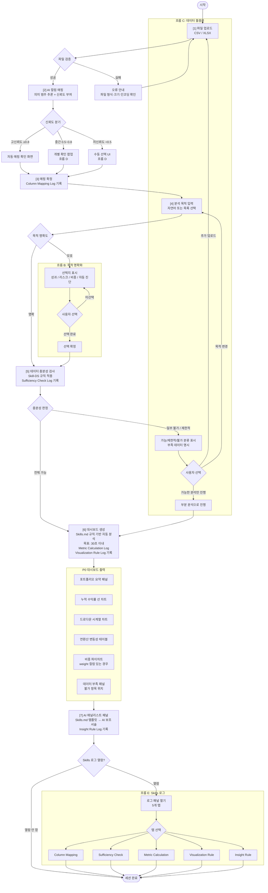
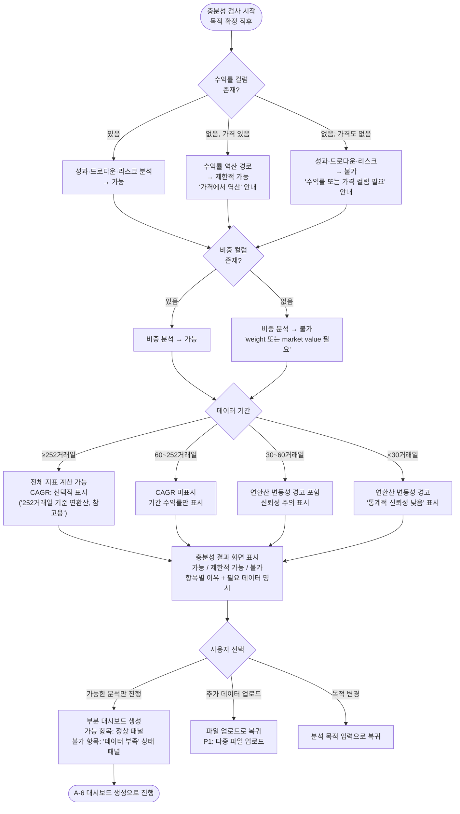
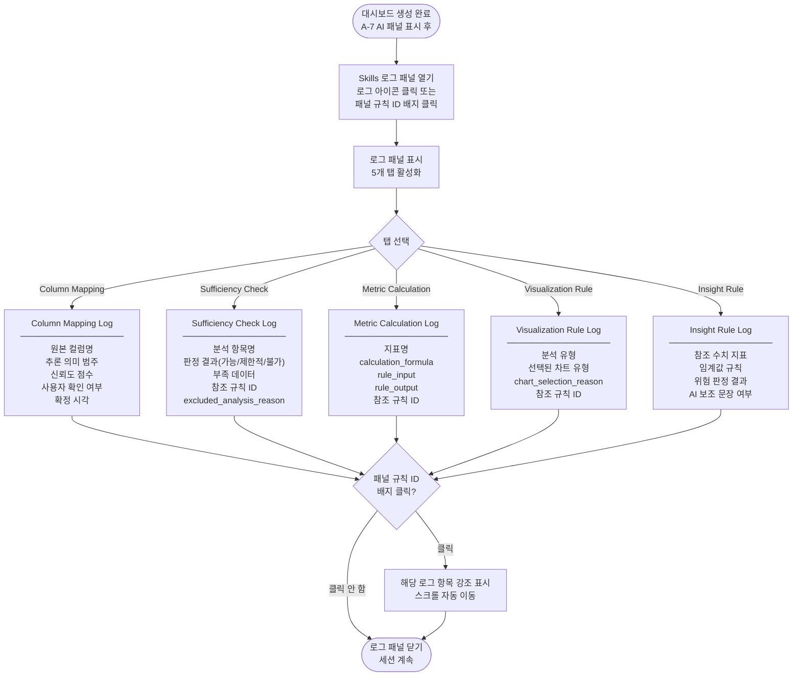

# 05. 사용자 흐름 정의서 — Skillfolio

작성일: 2026-04-30
작성 기준: 00_strategy_memo.md, 02_product_concept.md, 03_prd.md, 04_use_cases.md, codex_review_A_strategy_prd.md, gemini_review_A_judge_readability.md 전량 검토 완료

> **문서 규칙:** 이 문서는 Stage 4 Use Case 정의서를 입력으로 삼아, 각 사용 흐름을 단계 서술과 Mermaid 다이어그램으로 표현한다. P0/P1/P2 우선순위는 04_use_cases.md 및 review_A_resolution.md와 일치하며, 이 문서에서 독자적으로 변경하지 않는다. AI 관련 서술은 투자 권유, 미래 수익률 전망, 인과 관계 단정을 포함하지 않는다.

---

## 섹션 1. 이 문서의 목적

이 문서는 Skillfolio의 Stage 5 산출물로, Stage 4에서 정의한 Use Case를 **사용자가 화면에서 실제로 경험하는 단계별 흐름**으로 변환한다.

Stage 5의 핵심 역할은 다음과 같다.

첫째, P0 핵심 경로를 단일하고 명확한 흐름으로 확정한다. 심사위원과 개발자가 "어떤 순서로 무슨 일이 일어나는가"를 한눈에 파악할 수 있도록 단계를 명문화한다.

둘째, 분기점(목적 모호성, 컬럼 불확실성, 데이터 불충분)을 명확히 식별하고 각 분기에서 시스템이 어떻게 반응하는지를 서술한다. 분기는 P0 경로에서 이탈하지 않도록 설계된다.

셋째, Mermaid 다이어그램으로 흐름을 시각화하여 Stage 6 Screen Spec 작성자가 화면 전환 순서와 조건을 직접 참조할 수 있도록 한다.

넷째, P0 경계와 P1/P2 확장 진입 경계를 명시적으로 구분한다.

> **핵심 원칙 재확인:** 사용자는 두 가지를 가지고 온다 — 데이터(파일)와 목적(분석 의도). 시스템은 이 두 가지를 연결하는 역할을 하며, 어느 한쪽이 불분명하면 분석을 강행하지 않고 명확화 단계를 먼저 수행한다. 이것이 "User = Data + Goal" 원칙이다.

---

## 섹션 2. 전체 P0 흐름 개요

P0 핵심 경로는 8단계로 구성된다. 이 경로는 5종목 1년치 일별 수익률 CSV 업로드에서 시작하여 대시보드 생성과 Skills 로그 확인으로 종료된다. 30초 이내에 완주할 수 있어야 한다.

| 단계 | 이름 | 시스템 동작 요약 | 담당 PRD 기능 |
|------|------|----------------|-------------|
| 1 | 파일 업로드 | 파일 수신, 컬럼 목록 + 상위 5행 미리보기 표시 | F-UP-01 |
| 2 | AI 컬럼 매핑 | 신뢰도 기반 자동 추론, 신뢰도별 UI 분기 | F-CM-01, F-CM-02 |
| 3 | 매핑 확인 | 사용자가 매핑 결과를 확인·수정·확정 | F-CM-03 |
| 4 | 분석 목적 입력 | 자연어 입력 또는 목록 선택 | F-GC-01 |
| 4-B | 목적 모호성 명확화 | 모호한 입력 시 선택지 제시 → 사용자 확인 | F-GC-02 |
| 5 | 데이터 충분성 검사 | 분석 항목별 가능/제한적 가능/불가 판정 | F-DS-01, F-DS-02 |
| 6 | 대시보드 생성 | Skills.md 규칙 기반 자동 분석 + 레이아웃 생성 | F-AN-01~05, F-DB-01~05 |
| 7 | AI 애널리스트 패널 | Skills.md 템플릿 기반 해석 → AI 보조 서술 | F-AI-01 |
| 8 | Skills 로그 확인 | 5개 유형 로그 열람, 패널-규칙 ID 연결 | F-SL-01 |

**P0에서 명시적으로 제외된 항목 (P1 이상):**

| 항목 | 분류 | 이유 |
|------|------|------|
| 샤프 지수 | P1 | 무위험 수익률 데이터 미포함 |
| 집중도 분석 / HHI | P1 | 별도 Holdings 데이터 기반 |
| 벤치마크 비교 | P1 | 벤치마크 수익률 컬럼 필요 |
| 트리맵 | P1 | 비중 시각화 확장 기능 |
| Markdown 파일 다운로드 | P1 | P0는 화면 내 열람까지만 |
| PDF/PNG 내보내기 | P2 | P1 이후 확장 |
| 다중 파일 결합 | P1 | 단일 파일 분석 우선 |
| 거래내역 기반 성과 계산 | P1+ | 현금흐름·수수료 처리 복잡도 |

---

## 섹션 3. 흐름 A — 정상 P0 경로

이 흐름은 컬럼 매핑이 고신뢰도로 완료되고, 분석 목적이 명확하며, 데이터가 충분한 경우의 최단 경로다. P0 데모 시나리오가 이 경로를 완주한다.

### A-1. 파일 업로드

**사용자 행동:** 파일을 드래그 앤 드롭하거나 파일 선택 버튼을 클릭해 CSV 또는 XLSX 파일을 업로드한다.

**시스템 반응:**
- 파일을 수신하고 확장자·인코딩·크기를 검증한다.
- 검증 통과 시 컬럼 목록과 상위 5행의 데이터 미리보기를 즉시 표시한다.
- 컬럼 수, 행 수, 파일명, 탐지된 인코딩(UTF-8 / EUC-KR)을 요약 정보로 함께 표시한다.

**실패 조건:** 파일 크기 10MB 초과, 지원하지 않는 형식(.xls, PDF, 이미지), 파싱 불가 인코딩 → 명확한 오류 메시지와 조치 방법 표시.

### A-2. AI 컬럼 매핑

**시스템 동작:** AI가 각 컬럼명을 분석하여 분석 의미 범주(date, ticker, return, weight, price, quantity 등)로 추론하고 신뢰도 점수를 부여한다.

**신뢰도별 UI 분기:**

| 신뢰도 구간 | UI 동작 | 사용자 행동 |
|-----------|---------|-----------|
| 고신뢰도 (≥0.8) | 자동 매핑 결과를 확인 화면에 체크 상태로 표시 | 확인 후 넘어가거나 수정 가능 |
| 중간 신뢰도 (0.5~0.8) | 해당 컬럼에 개별 확인 팝업 표시 | 제안 수락 또는 드롭다운에서 직접 선택 |
| 저신뢰도 (<0.5) | 수동 선택 UI 표시, 제안 없음 | 사용자가 드롭다운에서 의미 범주 직접 선택 |
| 매핑 불가 | "이 컬럼의 의미를 확인할 수 없습니다. 분석에서 제외합니다." 안내 | 제외 수락 또는 수동 지정 |

**Column Mapping Log 기록:** 모든 매핑 결과(원본 컬럼명, 추론 의미, 신뢰도, 사용자 확인 여부, 확정 시각)가 자동 기록된다.

### A-3. 매핑 확정

**사용자 행동:** 전체 컬럼 매핑 결과를 검토하고 "확정" 버튼을 클릭한다.

**시스템 반응:** 확정된 매핑 기준으로 분석 가능한 항목 목록을 미리 표시한다. 이 시점 이후 매핑은 변경되지 않으며, 재매핑이 필요하면 "매핑 다시 하기"로 A-2로 복귀한다.

### A-4. 분석 목적 입력

**사용자 행동:** 자연어로 분석 목적을 입력하거나 사전 정의된 분석 항목 목록에서 선택한다.

**시스템 동작:**
- 입력이 단일 분석 항목으로 수렴 가능한 경우 → 즉시 A-5 데이터 충분성 검사로 진행.
- 입력이 모호한 경우 → 흐름 B(목적 모호성 명확화)로 분기.
- 입력이 지원 범위 밖인 경우("세금 계산", "자동매매" 등) → "이 서비스는 포트폴리오 성과·리스크·비중 분석을 지원합니다."로 안내 후 목록 표시.

### A-5. 데이터 충분성 검사

**시스템 동작:** 확정된 분석 목적과 매핑 결과를 기반으로 Skills.md의 SKILL-DS 규칙을 적용하여 각 분석 항목의 충분성을 판정한다.

**판정 결과 표시:**

| 판정 | 표시 방식 |
|------|---------|
| 가능 | 녹색 체크 + 분석 항목명 |
| 제한적 가능 | 황색 경고 + 분석 항목명 + 경고 이유(예: 데이터 기간 짧음) |
| 불가 | 적색 × + 분석 항목명 + 부족한 데이터 유형 + 해결 방법 안내 |

**P0 판정 기준 (일별 수익률 파일 기준):**
- 누적 수익률, 기간 수익률: 날짜 + 수익률 컬럼이 있으면 가능.
- MDD, 드로다운 차트, 회복 기간: 동일.
- 연환산 변동성: 30거래일 이상이면 가능(60거래일 미만이면 경고 포함).
- CAGR: 252거래일 이상인 경우에만 선택적 표시 가능. 252거래일 미만이면 미표시.
- 비중 분석: weight 컬럼이 있는 경우에만 가능.

**Sufficiency Check Log 기록:** 각 항목별 판정 결과, 참조 규칙 ID, 제외 사유(excluded_analysis_reason) 자동 기록.

**사용자 선택:**
1. "가능한 분석만으로 대시보드 생성" (권장) → A-6으로 진행.
2. "추가 데이터 업로드 후 재검사" → A-1로 복귀 (P1 기능: 다중 파일 업로드).
3. "분석 목적 변경" → A-4로 복귀.

### A-6. 대시보드 생성

**시스템 동작:** Skills.md에 정의된 규칙(SKILL-PERF, SKILL-RISK, SKILL-VIZ 등)을 적용하여 분석을 수행하고 대시보드를 30초 이내에 자동 생성한다.

**P0 대시보드 구성 (확정 출력 목록):**

| 패널 | 조건 | 참조 규칙 |
|------|------|---------|
| 포트폴리오 요약 패널 (최상단) | 항상 표시 | SKILL-PERF |
| 누적 수익률 선 차트 | 수익률 컬럼 있음 | SKILL-PERF, SKILL-VIZ-01 |
| 드로다운 시계열 차트 | 수익률 컬럼 있음 | SKILL-RISK, SKILL-VIZ-02 |
| 연환산 변동성 테이블 | 수익률 컬럼 있음 | SKILL-RISK, SKILL-VIZ-04 |
| 비중 파이차트 | weight 컬럼 있음 | SKILL-ALLOC, SKILL-VIZ-03 |
| "데이터 부족" 상태 패널 | 불가 항목 위치 | SKILL-DS |

각 패널 하단에 참조 규칙 ID 배지가 표시된다.

**Metric Calculation Log, Visualization Rule Log 기록:** 계산 공식, 입력값, 출력값, 차트 선택 사유 자동 기록.

### A-7. AI 애널리스트 패널

**동작 원칙:** Skills.md에 사전 정의된 리포트 템플릿(SKILL-INS)이 1차 생성 수단이다. AI는 템플릿에서 확정된 수치와 판정 결과를 자연어로 조합하여 서술을 완성한다. AI가 임의로 분석 방향을 결정하거나 데이터에 없는 정보를 추가하지 않는다.

**패널 구성:**
1. **고지 문구 (최상단):** "이 해석은 Skills.md 템플릿 기반으로 생성되었으며 비결정적 AI 보조 문장을 포함합니다. 투자 권유가 아닙니다."
2. **관찰된 수치 섹션:** "분석 기간 [시작일~종료일] 동안 포트폴리오 누적 수익률은 [X]%이며, 최대낙폭(MDD)은 [Y]%입니다. 연환산 변동성은 [Z]%입니다."
3. **Skills.md 임계값 기반 위험 경고:** MDD가 SKILL-RISK-01 임계값 이상이면 "MDD가 위험 수준입니다." 자동 표시.
4. **데이터 한계 고지:** 불가 항목(벤치마크, 샤프 지수 등) 및 그 이유.
5. **불가 분석 안내:** "벤치마크 비교는 벤치마크 수익률 컬럼이 파일에 포함된 경우 가능합니다."

**AI 패널 절대 금지 항목:**
- 투자 권유 ("이 포트폴리오를 추천합니다" 류)
- 미래 수익률 전망 ("향후 수익률은 [X]%로 예상됩니다" 류)
- 데이터에 없는 외부 시장 설명 ("최근 금리 인상으로 인해..." 류)
- 인과 관계 단정 ("A 때문에 MDD가 발생했습니다" 류)

**Insight Rule Log 기록:** 참조 수치 지표, 임계값 규칙, 위험 판정 결과, AI 보조 문장 사용 여부 자동 기록.

### A-8. Skills 로그 확인

**사용자 행동:** 대시보드 하단 또는 우측 패널의 "Skills 로그" 아이콘을 클릭한다.

**시스템 반응:** Skills 로그 패널이 슬라이드오버 또는 탭으로 열리며 5개 탭이 표시된다.

이 단계는 선택적이다. 사용자가 열람하지 않아도 흐름이 종료된다. 단, 공모전 시연에서는 이 단계를 반드시 포함한다 (Skills.md 제어의 증거 제시).

---

## 섹션 4. 흐름 B — 목적 모호성 명확화

**발동 조건:** 사용자가 입력한 분석 목적이 "이 포트폴리오 괜찮은지 봐줘", "분석해줘", "뭐가 문제인지" 등 단일 분석 항목으로 수렴하기 어려운 경우.

**흐름:**

1. 시스템이 모호성을 감지하고 분석을 시작하지 않는다.
2. AI 애널리스트 패널 영역에 다음 선택지가 표시된다:
   - **성과 분석:** 누적 수익률, 기간별 수익률
   - **리스크 분석:** MDD, 연환산 변동성
   - **비중 분석:** 종목별 비중 분포 (weight 컬럼 있는 경우)
   - **자동 진단:** P0 가능 분석 전체 수행
3. 사용자가 하나 이상을 선택하거나 "자동 진단"을 선택한다.
4. 사용자 확인 없이 분석이 진행되지 않는다.
5. 선택 확정 후 A-5 데이터 충분성 검사로 복귀한다.

**분기 추가 케이스:**

| 입력 유형 | 시스템 반응 |
|---------|---------|
| 지원 범위 밖 ("세금 계산") | "이 서비스는 포트폴리오 성과·리스크·비중 분석을 지원합니다." 후 선택지 표시 |
| 완전히 무관한 내용 ("날씨 알려줘") | "이 서비스는 투자 포트폴리오 분석을 지원합니다." 후 선택지 표시 |
| 장시간 미선택 | 타임아웃 후 "분석 목적을 선택해주세요." 재안내 |

**원칙:** 자동 진단은 사용자가 명시적으로 선택한 경우에만 실행된다. 시스템이 일방적으로 목적을 결정하거나 분석을 강행하지 않는다.

---

## 섹션 5. 흐름 C — 데이터 불충분

**발동 조건:** A-5 충분성 검사에서 하나 이상의 분석 항목이 "제한적 가능" 또는 "불가"로 판정된 경우.

**단계별 서술:**

1. **충분성 검사 결과 표시:**
   - 가능 / 제한적 가능 / 불가 세 구간으로 분류하여 표시.
   - 불가 항목에는 부족한 데이터 유형과 예시 컬럼명을 명시한다.
   - 예: "비중 분석 — 불가: 종목별 보유 비중(weight) 또는 평가금액(market value) 컬럼이 필요합니다."

2. **수익률 역산 분기:**
   - 수익률 컬럼 없음 + 가격 컬럼 있음 → "가격 컬럼에서 수익률을 역산하여 성과·드로다운·리스크 분석을 수행합니다." 안내 후 제한적 가능으로 진행.
   - 수익률·가격 모두 없음 → 성과·드로다운·리스크 전 불가. "현재 파일로 수행 가능한 분석이 없습니다." 안내.

3. **데이터 기간별 처리:**
   - 252거래일 이상: CAGR 선택적 표시 가능. 주의 레이블 포함.
   - 60~252거래일: CAGR 미표시. 기간 수익률만.
   - 30~60거래일: 연환산 변동성 계산 가능, 통계적 신뢰성 경고.
   - 30거래일 미만: 추가 경고 포함.

4. **사용자 선택지 표시:**
   - 가능한 분석만으로 대시보드 생성 (권장)
   - 추가 데이터 업로드 후 재검사 (P1: 다중 파일 업로드)
   - 분석 목적 변경

5. **부분 대시보드 생성:**
   - 가능 항목의 패널만 생성한다.
   - 불가 항목 위치에는 "데이터 부족 — [필요 데이터명]이 필요합니다." 상태 패널을 표시한다. 빈칸 또는 오류 화면으로 두지 않는다.

**Sufficiency Check Log 기록:** 판정 항목별 판정 결과, 부족 데이터, 참조 규칙 ID, excluded_analysis_reason 필드.

---

## 섹션 6. 흐름 D — 컬럼 매핑 불확실성

**발동 조건:** A-2 AI 컬럼 매핑 단계에서 하나 이상의 컬럼이 중간 신뢰도(0.5~0.8) 또는 저신뢰도(<0.5)로 판정된 경우.

**신뢰도별 세부 흐름:**

**중간 신뢰도 (0.5~0.8):**
1. 해당 컬럼에 개별 확인 팝업이 표시된다.
2. 팝업 내용: "이 컬럼은 [분석 의미]로 추론됩니다. 맞습니까?"
3. 사용자가 수락하면 확정. 아니면 드롭다운에서 다른 의미 범주를 선택한다.
4. 수정된 경우 Column Mapping Log에 "사용자 수정" 플래그가 기록된다.

**저신뢰도 (<0.5):**
1. 수동 선택 UI가 표시된다. AI 제안 없음.
2. 의미 범주 드롭다운: date, ticker, return, weight, price, quantity, benchmark_return, 분석 제외.
3. 사용자가 선택하거나 "분석 제외"를 선택한다.

**매핑 확정 불가:**
1. 시스템이 "이 컬럼의 의미를 확인할 수 없습니다. 분석에서 제외합니다." 안내.
2. 사용자가 수락하면 해당 컬럼을 제외하고 계속 진행.
3. 제외된 컬럼은 Column Mapping Log에 "제외" 상태로 기록된다.

**중요:** 저신뢰도 컬럼이 핵심 컬럼(날짜, 수익률)인 경우, 해당 분석이 불가로 판정되며 C-2 분기(데이터 불충분)로 연결된다.

**재매핑 경로:** 사용자는 대시보드 생성 이전 어느 단계에서도 "매핑 다시 하기"를 클릭하여 A-2로 복귀할 수 있다.

---

## 섹션 7. 흐름 E — Skills 로그 열람

**발동 조건:** A-8 단계에서 사용자가 Skills 로그 아이콘을 클릭한 경우. 또는 각 대시보드 패널 하단의 규칙 ID 배지를 클릭한 경우.

**로그 패널 구성:**

5개 탭이 제공된다. 각 탭은 Skills.md 제어의 서로 다른 측면을 보여준다.

| 탭 | 표시 내용 | 주요 필드 |
|----|---------|---------|
| Column Mapping | 각 컬럼의 매핑 과정 기록 | 원본 컬럼명, 추론 의미 범주, 신뢰도, 사용자 확인 여부, 확정 시각 |
| Sufficiency Check | 분석 항목별 충분성 판정 기록 | 분석 항목명, 판정 결과, 부족 데이터, 규칙 ID, excluded_analysis_reason |
| Metric Calculation | 지표 계산 과정 기록 | 지표명, calculation_formula, rule_input, rule_output, 규칙 ID |
| Visualization Rule | 차트 선택 이유 기록 | 분석 유형, 차트 유형, chart_selection_reason, 규칙 ID |
| Insight Rule | 위험 판정 및 AI 보조 기록 | 참조 수치 지표, 임계값 규칙, 위험 판정 결과, AI 보조 문장 여부 |

**패널-로그 연결 기능:**
- 각 대시보드 패널 하단의 규칙 ID 배지(예: SKILL-RISK-01)를 클릭하면 Skills 로그 패널이 자동으로 해당 항목으로 스크롤되며 강조 표시된다.

**공모전 시연 포인트:** Metric Calculation Log에서 MDD 계산 공식(`peak_to_trough`), 연환산 변동성 공식(`σ_daily × √252`), 누적 수익률 공식(`Π(1+r_t) - 1`)과 실제 입력값·출력값·규칙 ID를 함께 보여주는 장면이 "Skills.md가 대시보드를 제어했다"는 가장 강력한 증거다.

---

## 섹션 8. P1/P2 확장 경계

P0 대시보드 생성이 완료된 화면에서 다음 조건이 감지되면 P1 흐름 진입을 제안한다. 단, P1 흐름은 P0 데모 경로와 명확히 구분된 진입점(별도 버튼 또는 탭)을 통해서만 접근한다.

| 트리거 조건 | 분기 대상 | 우선순위 |
|-----------|---------|--------|
| Holdings 단독 파일 감지 (매매구분 없음, 수익률 없음, 비중/평가금액 있음) | UC-05 Holdings 비중 분석 | P1 |
| 컬럼 매핑에서 벤치마크 수익률 컬럼 감지 | UC-06 벤치마크 비교 분석 | P1 |
| 컬럼 매핑에서 매매구분 컬럼 감지 | UC-07 거래내역 인식 및 요약 | P1 |
| 대시보드 생성 완료 후 "Markdown 내보내기" 요청 | UC-08 Markdown 다운로드 | P1 |
| "PDF 내보내기" 또는 "PNG 내보내기" 요청 | UC-08 PDF/PNG 내보내기 | P2 |

**UC-07 거래내역 특이사항:** 거래내역 파일이 감지되더라도 거래내역만으로 수익률·MDD·변동성 등 성과 지표를 계산하지 않는다. 이 동작은 설계상 의도된 제한이다. 거래 목록 표시와 기간별 매수/매도 건수 요약만 제공한다. 성과 분석을 원하면 일별 수익률 또는 일별 가격 파일을 별도로 업로드해야 한다.

---

## 섹션 9. Mermaid 다이어그램 — 메인 P0 흐름

---

## 섹션 10. Mermaid 다이어그램 — 데이터 불충분 분기

---

## 섹션 11. Mermaid 다이어그램 — Skills 로그 분기

---

## 섹션 12. Stage 6 화면 명세 인계 사항

Stage 6 Screen Spec 작성자는 다음 항목을 화면 명세에 반드시 포함해야 한다.

### 12.1 화면 목록

이 문서에서 정의된 흐름에서 식별된 최소 화면 단위는 다음과 같다.

| 화면 ID | 화면 이름 | 해당 흐름 | 전환 조건 |
|--------|---------|---------|---------|
| SCR-01 | 랜딩 / 파일 업로드 | A-1 | 서비스 진입 시 기본 화면 |
| SCR-02 | 컬럼 미리보기 + 매핑 확인 | A-2, A-3, D | 파일 업로드 성공 시 |
| SCR-03 | 분석 목적 입력 | A-4 | 매핑 확정 후 |
| SCR-04 | 목적 명확화 선택 | B | 모호성 감지 시 SCR-03에서 분기 |
| SCR-05 | 충분성 검사 결과 | A-5, C | 목적 확정 후 |
| SCR-06 | 대시보드 메인 | A-6, A-7 | 충분성 검사 확인 후 |
| SCR-07 | Skills 로그 패널 | E | SCR-06에서 로그 아이콘 클릭 |
| SCR-08 | P1 분석 경계 안내 | P1 진입 | P1 트리거 감지 시 SCR-06에서 제안 |

### 12.2 분기 조건 명세 요청

Stage 6에서 각 화면 전환 조건을 명세할 때 다음 분기를 명시적으로 처리해야 한다.

1. **SCR-02 → SCR-02 (재매핑):** "매핑 다시 하기" 클릭 시.
2. **SCR-03 → SCR-04 (모호성 분기):** 입력 텍스트가 단일 분석 항목으로 수렴 불가 판정 시.
3. **SCR-05 → SCR-01 (추가 업로드):** 사용자가 "추가 데이터 업로드"를 선택하고 P1 다중 파일 기능이 활성화된 경우.
4. **SCR-06 → SCR-07 (로그 열람):** 로그 아이콘 클릭 또는 패널 규칙 ID 배지 클릭 시.
5. **SCR-06 → SCR-08 (P1 진입):** Holdings 단독 파일, 벤치마크 컬럼, 매매구분 컬럼 감지 시 → P1 진입 배너 또는 버튼 표시.

### 12.3 P0 경계 유지 요청

Stage 6 화면 명세에서 다음 항목은 P0 화면에 포함하지 않는다.

- 샤프 지수 입력 필드 또는 결과 패널
- HHI / 집중도 차트 패널
- 벤치마크 비교 패널 (P1 경계 안내만 표시)
- 트리맵 (P1 이후)
- Markdown 다운로드 버튼 (P1 이후)
- PDF / PNG 내보내기 버튼 (P2 이후)
- 다중 파일 업로드 UI (P1 이후)

### 12.4 AI 애널리스트 패널 UX 요청

- 패널 최상단에 고지 문구(비결정적 AI 보조, 투자 권유 아님)가 항상 표시되어야 한다.
- 임계값 기반 위험 경고는 Skills.md 규칙 ID와 함께 표시된다 (예: "MDD 위험 수준 — SKILL-RISK-01 기준").
- 패널 전체가 탭 또는 접힘/펼침 형태로 제공되어 대시보드를 가리지 않아야 한다.

### 12.5 Skills 로그 UX 요청

- 대시보드 생성 후 항상 접근 가능한 위치(아이콘 또는 우측 패널)에 배치.
- 5개 탭이 순서대로 표시되며, 탭 간 전환이 즉시 이루어져야 한다.
- 각 대시보드 패널 하단의 규칙 ID 배지 클릭 시 Skills 로그 패널이 열리고 해당 항목으로 스크롤된다.
- 로그가 기록되지 않은 경우(오류 등) "Skills 로그를 불러올 수 없습니다. 분석을 다시 실행해주세요." 안내.

### 12.6 P0 데모 흐름 완주 요건

- 파일 업로드에서 대시보드 생성까지 30초 이내.
- 비표준 컬럼명 파일("수익률_최종_최종.csv")도 오류 없이 처리.
- 매핑 확인, 자동 진단 선택, 충분성 검사 확인의 세 번의 사용자 클릭만으로 대시보드가 생성.
- Skills 로그 Metric Calculation 탭에서 MDD 공식, 연환산 변동성 공식, 누적 수익률 공식이 각각 확인 가능.
