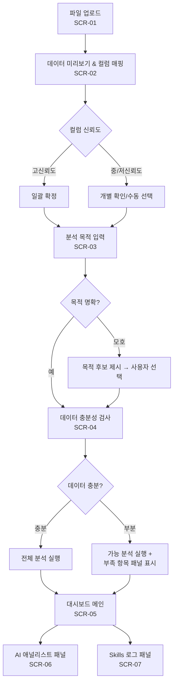

# Skillfolio — Skills.md 기반 AI 금융 포트폴리오 대시보드 서비스 개발 기획서

작성일: 2026-04-30
버전: 1.0 (공모전 제출용)

---

## 1. Executive Summary

**공개용 한 줄 소개:**
"제각각인 투자 CSV를 규칙 기반 포트폴리오 대시보드로 바꾸는 AI 금융 분석 서비스." (P0 샘플 데이터 기준, 30초 이내 완주 목표)

**기획서용 핵심 정의:**
Skillfolio는 사용자의 투자 CSV/XLSX와 분석 목적을 함께 해석하여, Skills.md에 정의된 금융 분석 규칙에 따라 가능한 분석만 자동 실행하고, 재현 가능한 포트폴리오 대시보드와 AI 애널리스트 리포트를 생성하는 서비스다.

**대상 사용자:** 포트폴리오 성과 보고를 담당하는 금융 데이터 실무자(1차 타깃), 개인 퀀트 연구자 및 투자 분석 학습자(2차 타깃).

**공모전 적합성:** 이 공모전의 핵심 요구사항은 "분석 규칙을 Skills.md에 문서화하고 그 규칙이 대시보드 생성에 실제로 작동함을 보여주는 것"이다. Skillfolio는 Skills.md를 단순 설명 문서가 아닌 분석 파이프라인 전체의 판단 기준으로 설계하며, Skills 로그가 규칙-결과 연결을 기록한다.

**P0 데모 핵심 장면:** 비정형 한국어 CSV 파일을 드롭 → AI가 컬럼 자동 매핑 → 사용자 목적 확인 → 데이터 충분성 판정 → 누적 수익률·MDD·변동성·비중 대시보드 자동 생성 → AI 애널리스트 패널 표시 → Skills 로그로 규칙 추적.

**Skills.md의 역할:** Skills.md는 컬럼 매핑 추론 기준, 데이터 충분성 판정 조건, 지표 계산 공식, 시각화 차트 선택 기준, 인사이트 해석 템플릿, 금지 표현 검증 규칙, 재현성 계약을 모두 사전 정의한다. Skills 로그는 이 규칙들이 실제로 대시보드 생성에 적용되었음을 기록한다.

---

## 2. 공모전 요구사항 해석

### 2.1 공모전의 본질적 요구

공모전의 공식 명칭은 "월간 해커톤: 투자 데이터를 시각화하라 — Skills 기반 대시보드 설계"다. 공식 설명에 따르면 Skills.md는 투자 데이터 분석 기준, 투자 지표 계산 규칙, 시각화 선택 기준, 리포트 구성 흐름, 인사이트 생성 규칙을 포함하는 "분석 규칙과 생성 지침을 담은 범용 MD 문서"를 의미한다.

본 기획서는 공모전의 핵심 평가 기준을 다음과 같이 해석한다. "분석 규칙을 Skills.md에 문서화하고, 그 규칙이 실제 대시보드 생성에 적용되는 구조를 보여주는 것." 분석 규칙과 대시보드 출력 간의 연결 구조가 평가의 주된 기준이라고 판단한다.

### 2.2 평가 항목 해석

| 평가항목 | 배점 | 우리의 해석 |
|---------|-----|-----------|
| 범용성 | 25 | 정의된 CSV/XLSX 데이터 유형(일별 수익률, 일별 가격, 보유 비중, 거래 내역) 내에서 컬럼 구조가 달라도 처리할 수 있는 유연성 |
| Skills.md 설계 | 25 | 규칙 ID 체계, 계산 공식, 임계값, 시각화 선택 기준, 인사이트 템플릿이 명시된 명세서 수준의 Skills.md |
| 대시보드 자동 생성 | 25 | 업로드에서 대시보드 생성까지 수작업 없이 완주되는 흐름, Skills.md 규칙에 따른 자동 분석 |
| 바이브코딩 활용 | 15 | Skills.md를 기준 문서로 삼아 AI 개발 도구가 화면·기능·분석 규칙 산출물을 일관되게 생성하고, 리뷰 에이전트가 P0 범위·금지 표현·재현성 조건을 검증하는 방식으로 바이브코딩을 활용한다 |
| 실용성 및 창의성 | 10 | 데이터 충분성 검사 + 부분 분석 + Skills 로그 가시화의 실무 활용 가능성 |

상위 3개 항목(범용성·Skills.md 설계·대시보드 자동 생성)의 합산이 75점이다. Skillfolio의 설계는 이 세 항목의 연결고리인 "Skills.md → 파이프라인 → 대시보드 → 로그"를 단일 구조로 구현한다.

### 2.3 Skillfolio의 해석

본 기획서의 설계 목표는 금융 포트폴리오 분석 규칙을 Skills.md에 재사용 가능한 형태로 정의하고, 그 규칙이 대시보드 생성 과정 전체를 제어하는 구조를 기획 수준에서 명세하는 것이다.

---

## 3. 문제 정의

### 3.1 문제 배경

금융 기업과 투자 실무 현장에서 포트폴리오 데이터는 Excel 또는 CSV 형식으로 수수하는 관행이 지속되고 있다. 거래내역 정산, 운용 성과 집계, 위험 지표 산출이 모두 이 파일 형식에서 출발하는 경우가 많다. 세 가지 변화가 이 문제를 가시화했다.

**첫째,** Julius AI, Power BI Copilot 등 AI 기반 데이터 분석 도구가 보급되었으나, 금융 도메인 분석 규칙은 사용자가 매 세션마다 프롬프트로 재정의해야 한다. Microsoft 공식 문서는 Copilot 생성 보고서가 비결정적(nondeterministic)이며 도메인 전문가를 대체할 수 없다고 명시한다.

**둘째,** Portfolio Visualizer, Sharesight, Koyfin 등 금융 특화 서비스는 성숙한 분석 기능을 제공하지만, 공개된 제품 설명을 검토하면 티커 기반 입력, 브로커 연동, 또는 자체 포트폴리오 등록 방식을 주된 데이터 진입 경로로 제시한다. 사용자의 비정형 CSV 컬럼명이 이들 시스템의 기대 스키마와 다를 경우 별도의 데이터 변환 작업이 필요하다 (기획 해석).

**셋째,** Skills.md 개념이 등장하면서, 분석 규칙을 사전에 문서화하고 그 문서에 기반해 대시보드를 자동 생성하는 구조가 기술적으로 가능해졌다. 이 구조를 공개된 제품 사용 흐름에서 전면에 제시하는 서비스는 확인되지 않는다 (기획 해석).

### 3.2 핵심 문제 구조: User = Data + Goal

사용자는 두 가지를 가지고 있다. 데이터(업로드한 파일)와 목적(분석하고 싶은 것)이다.

| 사용자가 가진 것 | 현재의 장벽 |
|--------------|------------|
| 포트폴리오 CSV (컬럼 구조 제각각) | 분석 서비스는 고정 스키마를 요구하는 경향이 있다 |
| 분석 목적 (성과, 리스크, 비중 파악 등) | AI 도구는 매번 사용자가 규칙을 직접 정의해야 한다 |

Skillfolio는 이 두 가지를 연결하는 역할을 한다. 어느 한쪽이 불분명하면 분석을 강행하지 않고 명확화 단계를 먼저 수행한다.

### 3.3 사용자 Pain Point

| # | Pain Point | 설명 | 페르소나 |
|---|-----------|------|--------|
| P1 | 파일을 올려도 분석이 바로 시작되지 않는다 | 서비스 스키마와 사용자 CSV 컬럼명이 다르면 변환 수작업이 선행된다 | A, B |
| P2 | 같은 데이터를 넣어도 분석 결과가 달라진다 | 범용 AI 도구는 세션 간 재현성이 보장되지 않는다 | A |
| P3 | 데이터가 부족할 때 오류를 내거나 침묵한다 | 어떤 분석이 가능하고 무엇이 부족한지 안내받지 못한다 | A, B |
| P4 | 차트를 만들었지만 왜 그런 결과인지 설명하기 어렵다 | 계산 규칙과 판단 기준을 추적할 수 없다 | A, B |
| P5 | 분석 결과를 바로 보고서로 쓸 수 없다 | 차트·수치 별도 생성 후 수작업으로 문서에 붙여넣어야 한다 | A |
| P6 | 데이터 형식마다 분석 흐름을 다시 설계해야 한다 | 일별 수익률과 보유 비중 파일은 구조가 달라 매번 재구성이 필요하다 | A, B |

---

## 4. 대상 사용자

### 4.1 페르소나 A: 투자 운용 실무자 (P0 1차 타깃)

| 항목 | 내용 |
|------|------|
| 역할 | 포트폴리오 분석 담당자, 운용 성과 보고서 작성자, 금융 데이터 실무자 |
| 보유 데이터 | 사내 시스템에서 내려받은 일별 수익률 CSV, 거래 상대방으로부터 수수한 Excel, 보유 종목 비중 시트 |
| 분석 목적 | 월간·분기별 성과 보고: 누적 수익률, MDD, 연환산 변동성, 종목별 비중 |
| 현재 도구의 한계 | Excel은 수식을 매번 재구성해야 하고 재현성이 낮다. 사내 보고 시스템은 정해진 양식에만 맞춰 사용해야 한다 |
| Skillfolio 가치 | 비정형 CSV 그대로 업로드 → 자동 분석 → 규칙 기반 대시보드 + 애널리스트 리포트 |

### 4.2 페르소나 B: 개인 퀀트 연구자 (P0 2차 타깃)

| 항목 | 내용 |
|------|------|
| 역할 | 퀀트 입문자, 금융 데이터 분석 학습자, 투자 분석 스터디 참여자 |
| 보유 데이터 | 다운로드한 주가 CSV, ETF 수익률 데이터, 직접 구성한 비중 시트 |
| 분석 목적 | 성과 분해, 드로다운 분석, 기초 리스크 지표, 비중 분포 확인 |
| 현재 도구의 한계 | Python은 시각화·리포트 정리에 추가 작업이 필요하다. 범용 AI 도구는 금융 지표 정의를 매번 포함해야 한다 |
| Skillfolio 가치 | 분석 규칙 재정의 없이 동일 품질의 대시보드 재현 |

---

## 5. 제품 개념

### 5.1 Skillfolio란

Skillfolio는 정의된 포트폴리오 CSV/XLSX 데이터 유형을 처리하는 웹 기반 금융 대시보드 서비스다. Skills.md에 정의된 규칙이 분석 흐름 전체를 제어하며, AI는 규칙 범위 안에서 컬럼 매핑 추론과 자연어 해석 보조에 한정된다.

**본 MVP 서비스 범위:**
- Skills.md에 정의된 규칙 기반 포트폴리오 분석 서비스
- 데이터 충분성을 먼저 확인하고 가능한 분석만 실행하는 서비스
- 모든 분석 단계의 적용 규칙을 Skills 로그에 기록하는 서비스

**본 MVP 범위 외:**
- 범용 BI 도구 기능 (임의 데이터 유형에 대한 범용 처리는 제공하지 않는다)
- 자유형 AI 챗봇 기능 (비정형 자연어 질의응답은 제공하지 않는다)
- 투자 추천·미래 수익률 전망·인과 관계 단정 출력
- 자동매매·브로커 연동

### 5.2 핵심 워크플로

| 단계 | 동작 | Skills.md 관여 |
|------|------|--------------|
| 1. 파일 업로드 | CSV/XLSX 수신, 형식 검증 | 지원 형식 목록 |
| 2. 데이터 미리보기 | 상위 5행 + 컬럼 목록 표시 | — |
| 3. AI 컬럼 매핑 제안 | 컬럼명 → 의미 범주 추론 + 신뢰도 | RULE-CM-xxx |
| 4. 사용자 매핑 확정 | 확인·수정·확정 | 확정 후 결정적 |
| 5. 분석 목적 입력 | 자연어 또는 후보 카드 선택 | RULE-GC-xxx |
| 6. 목적 모호성 명확화 | 모호한 입력 시 후보 제시 → 확인 | RULE-GC-xxx |
| 7. 데이터 충분성 검사 | 항목별 가능/제한/불가 판정 | RULE-DS-xxx |
| 8. 가능한 분석 자동 실행 | 수치 지표 계산, 시각화 생성 | RULE-AN-xxx, RULE-VZ-xxx |
| 9. 대시보드 자동 생성 | 규칙 기반 레이아웃 구성 | RULE-VZ-xxx |
| 10. AI 애널리스트 패널 | 템플릿 해석 → AI 자연어 보조 | RULE-IN-xxx, RULE-PO-xxx |
| 11. Skills 로그 확인 | 5개 유형 로그 열람, 규칙 ID 추적 | 전체 RULE-xxx |

---

## 6. 핵심 제품 원리: User = Data + Goal

Skillfolio는 사용자의 요청을 데이터셋 D와 분석 목적 G의 쌍으로 처리한다. 분석 실행 가능 여부는 D, G, 그리고 Skills.md 규칙의 함수다.

### 6.1 목적-데이터 결합 매트릭스

| | 데이터 충분 | 데이터 부분적 | 데이터 부족 |
|---|-----------|-----------|---------|
| **목적 명확** | 전체 분석 실행 | 가능 분석 실행 + "데이터 부족" 패널 표시 | 분석 불가 항목과 필요 데이터 안내 |
| **목적 모호** | 분석 목적 후보 제시 → 사용자 선택 후 실행 | 분석 목적 후보 제시 → 선택 후 부분 분석 | 분석 목적 후보 제시 → 선택 후 필요 데이터 안내 |

### 6.2 설계 원칙

**정책 1: 분석 목적 명확화 우선.**
분석 목적이 모호한 경우, 시스템은 분석을 즉시 시작하지 않는다. 성과 분석·위험 분석·비중 분석·자동 진단 중 선택지를 사용자에게 제시하며, 사용자 확인 없이 목적을 자동 확정하지 않는다.

**정책 2: 불가능한 분석은 사유를 표시하고, 가능한 분석은 계속 처리한다.**
데이터가 불충분한 경우에도 시스템은 오류를 출력하거나 분석을 전면 중단하지 않는다. 불가능한 분석 항목에는 사유와 필요 데이터를 표시하고, 가능한 분석 항목은 계속 처리하여 대시보드에 표시한다.

**정책 3: Skills.md 규칙이 분석 판단 기준을 결정한다.**
분석 가능 여부, 차트 유형 선택, 위험 경고 임계값은 모두 Skills.md에 사전 정의된 규칙에 따른다. AI가 임의로 계산 방식을 선택하거나 임계값을 설정하지 않는다.

**정책 4: 재현성 보장 범위를 수치 계산 영역으로 한정한다.**
동일 파일·동일 사용자 확정 매핑·동일 Skills.md 버전이 주어지면 수치 지표와 규칙 기반 시각화 구성이 재현된다. AI 애널리스트 패널의 자연어 표현은 실행마다 달라질 수 있으므로 재현성 보장 범위에서 제외한다.

---

## 7. MVP 범위

### 7.1 P0 범위 (공모전 데모 핵심 경로)

**지원 입력:**
- 단일 CSV/XLSX 파일 (10MB 이하)
- 5종목 1년치 일별 수익률 또는 일별 가격 데이터 (P0 데모 기준)
- 비중(weight) 컬럼: 존재 시 비중 분석 추가, 부재 시 비중 분석 패널 "데이터 부족" 상태 표시

**P0 분석 항목:**

| 분석 | 필요 컬럼 | 출력 |
|------|---------|------|
| 누적 수익률 | return 또는 price | 선 차트 |
| 구간 수익률 | return 또는 price | 수치 테이블 |
| 최대낙폭(MDD) | return 또는 price | MDD 수치 + 드로다운 차트 |
| 연환산 변동성 | return | 수치 테이블 |
| 기본 비중 분석 | weight (존재 시) | 파이/바 차트 |
| 데이터 충분성 결과 | — | 항목별 판정 테이블 |
| AI 애널리스트 패널 | 위 지표 결과 | 규칙 기반 해석문 |
| Skills 로그 | 전 단계 처리 결과 | 5개 유형 탭 |

**P0 명시적 제외 항목:**

| 항목 | 분류 | 이유 |
|------|------|------|
| CAGR (핵심 지표로서) | P1 참고용 | 거래일수 ≥252일 조건 미충족 시 표시 불가; 충족 시에도 경고 레이블 필수 참고용 표시만 허용 |
| 샤프 지수 | P1 | 무위험 수익률 데이터 미포함 |
| 집중도 분석 / HHI | P1 | Holdings 데이터 기반 별도 분석 |
| 벤치마크 비교 | P1 | 벤치마크 수익률 컬럼 필요 |
| 트리맵 | P1 | 비중 시각화 확장 기능 |
| Markdown 파일 다운로드 | P1 | P0는 화면 내 열람까지만 |
| PDF/PNG 내보내기 | P2 | P1 이후 확장 |
| 다중 파일 결합 | P1 | 단일 파일 분석 우선 |
| 거래내역 기반 성과 계산 | P1+ | 현금 흐름·수수료 처리 복잡도 |
| 실시간 시세·자동매매 | 영구 제외 | 서비스 범위 외 |

### 7.2 P1 범위

- Holdings/비중 독립 분석: 보유 종목 비중 기반 할당 테이블 + 파이/바 차트
- 벤치마크 비교: 파일 내 벤치마크 컬럼 존재 시 누적 수익률 비교 + 초과 수익 (트래킹 에러·정보 비율은 P2)
- 거래 내역 인식: 거래 목록 표시 + 기본 요약 (성과·MDD·변동성 역산은 제외)
- Markdown 내보내기
- 다중 파일 업로드
- CAGR: 거래일수 ≥252일 충족 시 경고 레이블 포함 참고용 표시

### 7.3 P2 범위

- PDF/PNG 내보내기
- 고급 비중 시각화: 트리맵, 섹터 드릴다운, 집중도 지수(HHI), Top-N 비중
- 고급 벤치마크 지표: 트래킹 에러, 정보 비율, 알파·베타
- 대시보드 레이아웃 수동 편집

---

## 8. P0 대표 데모 시나리오

**시나리오:** 포트폴리오 분석 담당자(페르소나 A)가 5종목 1년치 일별 수익률이 담긴 비정형 한국어 CSV 파일을 업로드해 월간 성과 리포트를 생성한다.

| 단계 | 화면 | 핵심 장면 | 심사위원 주목 포인트 |
|------|------|---------|-----------------|
| 1 | SCR-01 | 컬럼명이 "날짜", "종목코드", "수익률_조정", "비중" 등 비정형인 CSV 드롭 | 정의된 포트폴리오 데이터 유형의 CSV/XLSX라면 비정형 컬럼명도 처리 가능 |
| 2 | SCR-02 | AI가 컬럼명을 date·ticker·return·weight로 자동 추론, 신뢰도 표시 | 비정형 입력의 자동 처리 |
| 3 | SCR-02 | 사용자가 한 번 클릭으로 매핑 확정 | 수작업 없는 진입 |
| 4 | SCR-03 | "이 포트폴리오 괜찮은지 분석해줘" 입력 | 자연어 목적 입력 |
| 5 | SCR-03 | 시스템이 모호한 목적 감지 → 성과·위험·비중·자동 진단 후보 제시 | 목적 기반 라우팅 |
| 6 | SCR-03 | 사용자가 "자동 진단" 선택 | 사용자 확인 후 확정 |
| 7 | SCR-04 | 분석 항목별 판정 결과 표시 (누적 수익률·MDD·변동성 가능, 벤치마크 불가) | 데이터 충분성 검증 |
| 8 | SCR-05 | 누적 수익률·MDD·드로다운·변동성·비중 대시보드 자동 생성 | Skills.md 규칙 기반 자동화 |
| 9 | SCR-06 | AI 애널리스트 패널: 위험 레이블 + 해석문 + 데이터 한계 고지 | 규칙 기반 해석, 투자 권유 없음 |
| 10 | SCR-07 | Skills 로그 팝업: 5개 유형 탭, 규칙 ID 확인 | 재현성 증거물 |

**데모 첫 10초 장면:** 파일 드롭(2초) → 매핑 확인(3초) → 대시보드 생성(3초) → Skills 로그 팝업(2초). 이 흐름을 통해 심사위원은 Skills.md → 규칙 ID → 대시보드 카드의 연결을 직접 확인할 수 있다.

---

## 9. Use Case 요약

| UC | Use Case 명 | 우선순위 | 입력 데이터 | 출력 | 공모전 연결 |
|----|------------|--------|-----------|------|----------|
| UC-01 | 일별 수익률 CSV 기반 성과·리스크 대시보드 생성 | P0 | 일별 수익률 CSV | 누적 수익률·MDD·변동성 대시보드 | 대시보드 자동 생성 (25점) |
| UC-02 | 모호한 분석 목적 명확화 | P0 | 모호한 자연어 목적 입력 | 분석 목적 후보 제시 → 사용자 선택 | 범용성 (25점) |
| UC-03 | 데이터 부족 시 가능·불가 분리 | P0 | 불완전한 CSV | 가능 분석 실행 + 불가 항목 "데이터 부족" 패널 | Skills.md 설계 (25점) |
| UC-04 | Skills 로그로 규칙 기반 분석 검증 | P0 | 대시보드 생성 결과 | 5개 유형 로그 열람, 규칙 ID 추적 | Skills.md 설계 (25점) |
| UC-05 | Holdings/비중 기반 포트폴리오 비중 분석 | P1 | 보유 종목 + 비중 파일 | 할당 테이블 + 파이/바 차트 | 범용성 (25점) |
| UC-06 | 벤치마크 데이터 포함 시 비교 분석 | P1 | 포트폴리오 + 벤치마크 컬럼 | 포트폴리오 vs 벤치마크 누적 수익률 + 초과 수익 | 범용성 (25점) |
| UC-07 | 거래 내역 인식 및 거래 요약 | P1 | 거래 내역 파일 | 거래 목록 + 기본 요약 (성과 계산 제외) | 범용성 (25점) |
| UC-08 | Markdown/PDF/PNG 리포트 내보내기 | P1/P2 | 대시보드 결과 | Markdown(P1), PDF/PNG(P2) | 실용성 (10점) |

---

## 10. User Flow 요약

### 10.1 주요 흐름 유형

| 흐름 | 조건 | 결과 |
|------|------|------|
| 흐름 A: 정상 P0 경로 | 컬럼 고신뢰도, 목적 명확, 데이터 충분 | 전체 P0 대시보드 생성 |
| 흐름 B: 목적 모호성 명확화 | 모호한 자연어 입력 | 후보 제시 → 선택 → 정상 경로 합류 |
| 흐름 C: 데이터 불충분 | 필요 컬럼 부재 | 가능 분석 실행 + "데이터 부족" 패널 |
| 흐름 D: 컬럼 매핑 불확실 | 중간/저신뢰도 컬럼 존재 | 팝업/드롭다운 확인 → 확정 후 진행 |
| 흐름 E: Skills 로그 열람 | 대시보드 생성 후 | 5개 유형 탭 열람, 규칙 ID 확인 |

### 10.2 P0 핵심 흐름 다이어그램



### 10.3 P1/P2 확장 경계

대시보드 화면(SCR-05)에서 P1/P2 기능을 요청하면 SCR-08(P1/P2 확장 안내)로 이동한다. P0 분석 결과는 유지되며 확장 기능은 별도 안내만 표시된다.

---

## 11. 화면 설계 요약

### 11.1 전체 레이아웃

```
┌─────────────────────────────────────────────────────────────┐
│  상태 바: 파일명 | 매핑 상태 | 분석 목적 | 단계 진행 표시      │
├────────────────────────────┬────────────────────────────────┤
│  대시보드 캔버스 (좌측)       │  AI 애널리스트 패널 (우측)       │
│  - 누적 수익률 선 차트        │  - Skills.md 템플릿 해석문       │
│  - 구간 수익률 테이블         │  - 데이터 한계 고지             │
│  - MDD + 드로다운 차트        │  - 위험 판정 레이블             │
│  - 연환산 변동성 테이블        │                                │
│  - 기본 비중 차트 (조건부)     │                                │
├────────────────────────────┴────────────────────────────────┤
│  Skills 로그 슬라이드오버 (하단 토글)                          │
│  [Column Mapping] [Sufficiency] [Metric] [Visualization] [Insight] │
└─────────────────────────────────────────────────────────────┘
```

**좌측 = 사실 (수치·차트), 우측 = 해석 (AI 패널).** 각 대시보드 카드 하단에 참조 규칙 ID가 표시된다.

### 11.2 화면 목록

| 화면 ID | 화면명 | 목적 | 핵심 구성 요소 |
|---------|--------|------|-------------|
| SCR-01 | 파일 업로드 | 파일 수신 및 형식 검증 | 드래그앤드롭 영역, 지원 형식 안내 |
| SCR-02 | 데이터 미리보기 & 컬럼 매핑 | 매핑 확인 및 확정 | 미리보기 테이블, 컬럼-범주-신뢰도 매핑 표 |
| SCR-03 | 분석 목적 입력 | 목적 확정 및 모호성 해소 | 자연어 입력창, 목적 후보 카드 |
| SCR-04 | 데이터 충분성 결과 | 분석 가능 여부 명시 | 분석 항목별 판정 테이블 |
| SCR-05 | 대시보드 메인 | P0 분석 결과 시각화 | 차트 카드, 규칙 ID 배지 |
| SCR-06 | AI 애널리스트 패널 | 규칙 기반 해석문 표시 | 템플릿 해석문, 위험 레이블, 데이터 한계 |
| SCR-07 | Skills 로그 패널 | 규칙-결과 추적 | 5개 유형 탭, 필드 상세 열람 |
| SCR-08 | P1/P2 확장 안내 | P0 경계 외 기능 안내 | 기능 설명, 필요 추가 데이터 안내 |

---

## 12. 기능 정의 요약

### 12.1 P0 기능 목록

| Feature ID | 기능 | 연관 화면 | 설명 | 수용 기준 |
|-----------|------|---------|------|---------|
| F-UP-01 | 단일 파일 업로드 | SCR-01 | CSV/XLSX 수신, 형식·인코딩·크기 검증 | 10MB 이하 CSV/XLSX → 미리보기 표시; 오류 시 원인 메시지 |
| F-CM-01 | AI 컬럼 매핑 추론 | SCR-02 | 컬럼명 → 의미 범주 추론 + 신뢰도 | 고/중/저 3단계 신뢰도 구분 표시 |
| F-CM-02 | 신뢰도별 UI 분기 | SCR-02 | 고: 일괄 확인, 중: 개별 팝업, 저: 수동 드롭다운 | 각 구간별 지정 UI 동작 |
| F-CM-03 | 매핑 확정 | SCR-02 | 사용자 확인 후 확정, Column Mapping Log 기록 | 확정 시 로그에 원본명·범주·신뢰도·확정 시각 포함 |
| F-GC-01 | 분석 목적 입력 | SCR-03 | 자연어 입력 또는 후보 카드 선택 | 목적 범주 확정 후 충분성 검사 진행 |
| F-GC-02 | 목적 모호성 명확화 | SCR-03 | 모호한 입력 시 후보 제시 → 사용자 확인 | 사용자 확인 없이 목적 일방 확정 금지 |
| F-DS-01 | 데이터 충분성 검사 | SCR-04 | 분석 항목별 필요 컬럼 존재 여부 판정 | 가능/제한/불가 3단계, 불가 항목에 필요 데이터 명시 |
| F-DS-02 | 부분 분석 실행 | SCR-04→05 | 불가 항목 "데이터 부족" 패널, 가능 항목만 실행 | 침묵·오류 금지; 사유와 함께 표시 |
| F-AN-01 | 누적 수익률 계산 | SCR-05 | Skills.md 공식 기반 계산 | 동일 입력·매핑·규칙에서 결과 재현 가능 |
| F-AN-02 | 구간 수익률 계산 | SCR-05 | 일간·월간·전체 구간 | 결정적 출력 |
| F-AN-03 | MDD 및 드로다운 계산 | SCR-05 | 최대낙폭 수치 + 드로다운 시계열 | MDD 수치와 차트 모두 표시 |
| F-AN-04 | 연환산 변동성 계산 | SCR-05 | std(일별 수익률) × √252 | 계산 공식 Metric Log에 기록 |
| F-AN-05 | 기본 비중 분석 | SCR-05 | weight 컬럼 존재 시 할당 테이블 + 파이/바 차트 | 컬럼 부재 시 "데이터 부족" 패널 |
| F-DB-01 | 대시보드 자동 생성 | SCR-05 | Skills.md 시각화 규칙 기반 차트 유형·레이아웃 자동 선택 | 카드 하단 참조 규칙 ID 표시 |
| F-AI-01 | AI 애널리스트 패널 | SCR-06 | Skills.md 템플릿 → AI 자연어 보조 (금지 표현 검증 후) | 투자 권유·미래 전망·인과 단정 금지 |
| F-SL-01 | Skills 로그 | SCR-07 | 5개 유형 로그 기록 및 탭 열람, 규칙 ID 양방향 연결 | 각 분석 단계마다 해당 유형 로그 기록 |

### 12.2 P1/P2 기능 경계

| 기능 | 분류 | 진입 조건 |
|------|------|---------|
| Holdings 비중 분석 (할당 테이블 + 파이/바 차트) | P1 | 보유 비중 파일 업로드 |
| 벤치마크 비교 | P1 | 파일 내 벤치마크 컬럼 존재 |
| 거래 내역 요약 (목록·요약만, 성과 계산 제외) | P1 | 거래 내역 파일 업로드 |
| CAGR 참고용 표시 | P1 | 거래일수 ≥252일 + 경고 레이블 필수 |
| Markdown 내보내기 | P1 | P0 대시보드 완성 후 |
| 다중 파일 업로드 | P1 | P0 이후 |
| PDF/PNG 내보내기 | P2 | P1 이후 |
| 고급 비중 시각화 (트리맵, HHI, Top-N) | P2 | P1 Holdings 이후 |
| 고급 벤치마크 지표 (트래킹 에러, 정보 비율) | P2 | P1 벤치마크 이후 |

---

## 13. Skills.md 설계

### 13.1 Skills.md의 역할

본 기획서에서 Skills.md는 분석 처리 흐름 전체의 판단 기준을 사전 정의하는 **규칙 명세서**로 설계한다. AI는 이 규칙 범위 안에서만 작동한다.

Skills.md가 사전 정의하는 규칙 영역:
- 비정형 컬럼명을 분석 의미 단위로 추론하는 기준 (컬럼 매핑 규칙)
- 모호한 목적 입력을 분석 가능 범주로 변환하는 기준 (목적 명확화 규칙)
- 분석 항목별 필요 컬럼·데이터 기간 조건 (데이터 충분성 규칙)
- 각 지표의 계산 공식과 거래일수 기준 (지표 계산 규칙)
- 데이터 유형별 차트 유형 결정 로직 (시각화 선택 규칙)
- 위험 판정 임계값과 해석문 템플릿 (인사이트 템플릿 규칙)
- AI 출력에서 허용되지 않는 표현 유형 (금지 표현 규칙)
- 결정적 출력 보장 범위와 비결정 구간 (재현성 계약)

### 13.2 Skills.md 구조 (제안 개요)

```
Skills.md
├── metadata          # 버전, 서비스명, 최종 수정일
├── supported_input_types
│   ├── daily_returns     # 일별 수익률
│   ├── daily_prices      # 일별 가격
│   ├── holdings_weights  # 보유 비중 (P1)
│   └── transaction_log   # 거래 내역 (P1: 목록·요약만)
├── column_mapping_rules       # RULE-CM-xxx
├── goal_clarification_rules   # RULE-GC-xxx
├── data_sufficiency_rules     # RULE-DS-xxx
├── metric_rules               # RULE-AN-xxx
├── visualization_rules        # RULE-VZ-xxx
├── insight_templates          # RULE-IN-xxx
├── prohibited_outputs         # RULE-PO-xxx
├── skills_log_schema          # 5개 유형 필드 명세
└── reproducibility_contract   # 결정적/비결정적 경계 명시
```

### 13.3 규칙 예시

**RULE-CM-001: 수익률 컬럼 추론**
- 인식 패턴: "수익률", "returns", "pnl", "ret", "일별수익률"
- 신뢰도 고(≥0.8): 자동 확정 / 중(0.5–0.8): 사용자 팝업 / 저(<0.5): 수동 선택

**RULE-DS-001: MDD 충분성 조건**
- 필요 컬럼: return 또는 price
- 최소 기간: 30거래일
- 부재 시 판정: 불가 — `excluded_analysis_reason`: "return/price 컬럼 없음"

**RULE-AN-001: 누적 수익률** — `∏(1 + r_t) − 1`, 결정적

**RULE-AN-002: MDD** — `min((V_t − max(V₀…Vₜ)) / max(V₀…Vₜ))`, 결정적

**RULE-AN-003: 연환산 변동성** — `std(일별 수익률) × √252`, 결정적. CAGR은 거래일수 ≥252일 조건부 참고용 표시, 경고 레이블 필수.

**RULE-VZ-001: 시계열 → 선 차트** — `chart_selection_reason`: "시계열 추이 표현에 선 차트가 적합"

**RULE-IN-001: MDD 위험 판정 템플릿**
- < −20%: "주의" 레이블 + 템플릿 해석문
- −10%~−20%: "경계" 레이블
- ≥ −10%: 정상
- AI는 자연어 표현만 보조; 금지 표현 검증 후 출력

**RULE-PO-001: 금지 표현**
- 투자 권유, 미래 수익률 전망, 인과 관계 단정, 업로드 데이터 외 시장 설명 금지
- 위반 시 해당 문장 제거 후 재출력; 재출력 실패 시 템플릿 문장으로 대체

---

## 14. AI 오케스트레이션 설계

본 섹션은 실제 배포 마이크로서비스 명세가 아닌 기능 모듈 설계다. 각 모듈은 독립적 역할을 가지며, 이전 단계의 확정 출력만을 입력으로 사용한다.

| 모듈 | 입력 | 출력 | 규칙 의존 | 실패 처리 |
|------|------|------|---------|---------|
| Data Profiler | 업로드 파일 | 컬럼 목록, 행 수, 인코딩 요약 | 지원 형식 목록 | 형식 오류 → 오류 메시지 + 조치 안내 |
| Column Mapper | 컬럼 목록 | 컬럼-범주 매핑 후보 + 신뢰도 | RULE-CM-xxx | 전체 저신뢰도 → 수동 입력 유도 |
| Goal Clarifier | 사용자 목적 | 확정된 분석 목적 범주 | RULE-GC-xxx | 모호 → 후보 카드 제시 |
| Sufficiency Checker | 확정 매핑 + 목적 | 항목별 판정 + `excluded_analysis_reason` | RULE-DS-xxx | 전체 불가 → 파일 유형 변경 안내 |
| Metric Engine | 확정 매핑 + 가능 분석 목록 | 지표 계산 결과 + rule_input/output | RULE-AN-xxx | 계산 오류 → 해당 패널만 "오류" 표시 |
| Dashboard Composer | 계산 결과 + 분석 유형 | 카드 레이아웃 + 차트 유형 | RULE-VZ-xxx | 규칙 미매칭 → 기본 선 차트 fallback |
| Analyst Panel Generator | 계산 결과 + 인사이트 템플릿 | 템플릿 해석문 → AI 자연어 보조 | RULE-IN-xxx | AI 오류 → 템플릿 문장만 표시 |
| Skills Logger | 각 단계 처리 결과 | 5개 유형 로그 기록 | 전체 RULE | 로그 실패 → 분석 유지, 경고 표시 |
| Critic/Guardrail Checker | AI 해석문 초안 | 금지 표현 검증 통과 + 정제 해석문 | RULE-PO-xxx | 위반 → 해당 문장 제거 재출력 |

**사람 개입 지점 (Human-in-the-loop):**
1. 컬럼 매핑 확인 (SCR-02): 사용자 확인 없이 자동 확정 금지
2. 분석 목적 명확화 (SCR-03): 모호한 목적의 일방 확정 금지
3. 가능한 분석으로 진행 확정 (SCR-04): 사용자 확인 후 진행
4. Skills 로그 열람 (SCR-07): 선택적, 항상 접근 가능

---

## 15. 데이터 충분성 판단 정책

시스템은 다음 순서로 충분성을 판단한다.

1. **필요 컬럼 존재 여부:** 요청 분석에 필요한 컬럼이 파일 내에 있는가
2. **대체 컬럼 가능성:** 없는 경우, 가격 컬럼에서 수익률을 역산할 수 있는가
3. **부분 분석 가능성:** 대체도 불가한 경우, 일부 지표만 계산 가능한가
4. **필요 데이터 안내:** 부분 분석도 불가한 경우, 어떤 추가 데이터가 필요한지 명시

**판단 예시:**

| 상황 | 시스템 반응 |
|------|----------|
| return 컬럼 없고 price 컬럼 있음 | 수익률 역산 후 분석 진행, 역산 사실 로그 기록 |
| 벤치마크 비교 요청 + 벤치마크 컬럼 없음 | 포트폴리오 분석만 실행, 벤치마크 비교는 "데이터 부족" 패널 |
| weight 컬럼 없음 | 비중 분석 패널 "데이터 부족" 표시, 다른 분석은 정상 실행 |
| return + price 모두 없음 | 성과·위험 분석 불가 안내 + 필요 컬럼 명시 |
| 거래 내역 파일만 존재 | 거래 목록 + 기본 요약만 (수익률·MDD·변동성 역산은 P1+) |

불가능한 분석은 사유와 필요 데이터를 "데이터 부족" 패널에 명시하고, 가능한 분석은 계속 처리한다. 오류 출력이나 공백 화면으로 처리하지 않는다.

---

## 16. 재현성 및 감사 가능성

### 16.1 결정적 처리 vs AI 보조 처리 경계

| 처리 단계 | 결정적 여부 | 제어 정책 |
|---------|-----------|---------|
| 파일 파싱 | 결정적 | 지원 형식 목록 기반 |
| 컬럼 매핑 추론 (초기) | 비결정적 | 신뢰도 표시, 사용자 확인 필수 |
| 컬럼 매핑 (사용자 확정 후) | 결정적 | Column Mapping Log에 확정 시각 기록 |
| 데이터 충분성 판정 | 결정적 | RULE-DS-xxx 기준 |
| 지표 계산 | 결정적 | RULE-AN-xxx 공식 고정 |
| 시각화 선택 | 결정적 | RULE-VZ-xxx 기준 |
| AI 애널리스트 해석문 | 비결정적 | 금지 표현 검증(RULE-PO-001) 후 출력 |
| Skills 로그 기록 | 결정적 | 수정 불가 형태로 자동 기록 |

### 16.2 재현성 계약

동일 파일, 동일 사용자 확정 매핑, 동일 Skills.md 버전이 주어지면 수치 지표와 규칙 기반 시각화 구성이 재현된다. AI 애널리스트 패널의 자연어 표현은 실행마다 달라질 수 있으므로 재현성 보장 범위에서 제외한다.

재현성이 보장되는 항목: 누적 수익률, 구간 수익률, MDD, 드로다운 시계열, 연환산 변동성, 시각화 차트 유형 선택, 대시보드 레이아웃 구성 규칙, Skills 로그

재현성 범위 외 항목: AI 애널리스트 패널 자연어 서술, 초기 컬럼 매핑 추론 결과 (사용자 확정 전)

---

## 17. Skills 로그 설계

Skills 로그는 Skills.md 규칙이 실제 대시보드 생성에 적용되었음을 기록하는 감사 항목이다. 대시보드 카드 하단에 표시된 규칙 ID를 클릭하면 해당 로그 항목으로 이동하는 양방향 연결 구조를 제공한다.

| 로그 유형 | 트리거 | 필수 필드 | 역할 |
|---------|------|---------|------|
| Column Mapping Log | 매핑 확정 (SCR-02) | 원본 컬럼명, 추론 범주, 신뢰도, 사용자 확인 여부, 확정 시각 | 컬럼 해석 투명성 |
| Sufficiency Check Log | 충분성 판정 (SCR-04) | 분석 항목명, 판정 결과, 부족 데이터, 규칙 ID, `excluded_analysis_reason` | 분석 제외 근거 추적 |
| Metric Calculation Log | 지표 계산 완료 (SCR-05) | 지표명, `calculation_formula`, `rule_input`, `rule_output`, 규칙 ID | 수치 재현성 근거 |
| Visualization Rule Log | 차트 생성 (SCR-05) | 분석 유형, 차트 유형, `chart_selection_reason`, 규칙 ID | 시각화 선택 근거 |
| Insight Rule Log | AI 패널 출력 (SCR-06) | 참조 지표, 임계값 규칙, 위험 판정 결과, AI 보조 문장 여부 | 해석 근거와 AI 개입 범위 |

Metric Calculation Log의 `calculation_formula`, `rule_input`, `rule_output` 필드를 통해 심사위원이 계산 과정을 직접 확인할 수 있다. 이 항목은 Skills.md 규칙이 실제 수치 산출에 적용되었음을 확인하는 근거가 된다.

---

## 18. AI 애널리스트 패널 설계

### 18.1 작동 원칙

1차: Skills.md RULE-IN-xxx 템플릿이 트리거 조건(임계값 초과 여부)을 판단하고 해석문 구조를 결정한다.
2차: AI가 템플릿 결과를 자연어로 polishing한다.
3차: Critic/Guardrail Checker가 금지 표현 검증을 수행하고 통과된 문장만 출력한다.

### 18.2 금지 출력 유형

- 투자 권유 표현 ("매수", "매도", "보유 추천")
- 미래 수익률 전망 ("향후 수익", "상승 예상")
- 근거 없는 인과 관계 단정 ("A 때문에 B가 하락")
- 업로드 데이터 외 외부 시장 설명 (데이터에 포함되지 않은 시장 상황 서술)

### 18.3 패널 구성 항목

| 항목 | 내용 |
|------|------|
| 면책 고지 | "이 리포트는 투자 권유가 아니며, 업로드된 데이터의 분석 결과를 요약한 것이다" |
| 관찰된 주요 지표 | 누적 수익률, MDD, 연환산 변동성 수치 요약 |
| 위험 레이블 | Skills.md RULE-IN-001 기준 위험 판정 결과 |
| 데이터 한계 | 분석 기간, 데이터 수, 부재 컬럼 기반 분석 제한 사항 |
| 불가능한 분석 안내 | Sufficiency Check 결과 기반 추가 필요 데이터 명시 |
| Skills 로그 참조 | "이 해석은 RULE-IN-001, RULE-IN-002를 따릅니다" |

---

## 19. 공모전 평가항목별 대응 전략

| 평가항목 | 배점 | Skillfolio 대응 | 데모에서의 증거 |
|---------|-----|----------------|--------------|
| 범용성 | 25 | 정의된 CSV/XLSX 데이터 유형 내에서 컬럼 구조가 달라도 처리; RULE-CM-xxx가 비정형 컬럼명 추론 | 비정형 한국어 컬럼명 CSV 업로드 후 자동 매핑 장면 |
| Skills.md 설계 | 25 | 8개 규칙 영역, 규칙 ID 체계, 예시 규칙 블록, Skills 로그 5개 유형이 명세서 수준으로 제출됨 | Skills 로그 팝업에서 규칙 ID와 계산 공식 직접 확인 |
| 대시보드 자동 생성 | 25 | 9개 모듈 처리 흐름이 업로드부터 대시보드까지 수작업 없이 자동 완주; RULE-VZ-xxx가 차트 유형 자동 선택 | 업로드 → 대시보드 P0 샘플 데이터 기준 30초 이내 완주 장면 |
| 바이브코딩 활용 | 15 | Skills.md를 기준 문서로 삼아 AI 개발 도구가 화면·기능·분석 규칙 산출물을 일관되게 생성하고, 리뷰 에이전트가 P0 범위·금지 표현·재현성 조건을 검증하는 방식으로 바이브코딩을 활용한다 (AI 개발 도구 예시: Claude Code Subagents) | Skills.md 기준으로 생성된 코드·대시보드 연결 관계 및 리뷰 로그 제시 |
| 실용성 및 창의성 | 10 | 데이터 충분성 검사 + "침묵 대신 부분 분석" + Skills 로그 가시화가 실무 활용 가능성을 높임 | 벤치마크 컬럼 부재 시 "데이터 부족" 패널 표시 장면 |

**범용성 범위 정의:** 본 기획서에서의 범용성은 "정의된 4개 데이터 유형(일별 수익률, 일별 가격, 보유 비중, 거래 내역) 내에서 컬럼 구조가 다양해도 처리할 수 있는 유연성"으로 한정한다. 임의 투자 데이터 전체에 대한 범용 처리는 본 범위에 포함되지 않는다.

---

## 20. 기존 서비스 대비 차별화

> **면책 표기:** 이하 서술은 각 서비스의 공개된 제품 설명을 기반으로 한 기획 해석이며, 해당 서비스의 공식 결함 선언이 아니다.

| 비교 대상 | 공개 정보 기반 특징 | Skillfolio의 차별화 설계 |
|---------|-----------------|----------------------|
| 범용 AI 분석 도구 (Julius AI 등) | CSV 업로드 + 자연어 분석 지원. 금융 지표를 포함한 다양한 분석이 프롬프트 기반으로 가능 | Skills.md 기반 금융 포트폴리오 전용 규칙이 분석 흐름 전체를 제어하는 구조가 공개 사용 흐름에서 전면화되어 있지 않다. Skillfolio는 이를 공모전 요구사항에 맞춰 전면 기능으로 설계한다 |
| 범용 BI + AI (Power BI Copilot 등) | CSV 업로드와 자연어 대시보드 생성 지원. Microsoft 공식 문서는 Copilot 출력의 비결정성을 명시 | Skills.md가 금융 포트폴리오 전용 규칙을 사전 정의하고 Skills 로그가 규칙-결과 연결을 기록한다. 결정적 수치 계산 영역에서 재현성을 보장한다 |
| 금융 특화 분석 서비스 (Portfolio Visualizer, Koyfin, Sharesight 등) | 티커 입력, 브로커 연동, 자체 포트폴리오 등록을 주된 데이터 진입 경로로 제시 (기획 해석) | 비정형 CSV/XLSX를 그대로 업로드해 AI 컬럼 매핑으로 진입하는 경로가 공개 사용 흐름의 전면에 제시되어 있지 않다. Skillfolio는 이를 진입 경로 설계의 핵심으로 삼는다 |

**Skillfolio의 설계 차별점 (기획 해석):**

1. **Data + Goal 동시 해석:** 파일과 분석 목적을 함께 입력받아, 충분성 판단 후 가능한 분석만 실행한다
2. **분석 전 충분성 검사:** 실행 전에 분석 항목별 가능 여부를 명시한다
3. **부분 분석 처리:** 불가능한 분석 항목에는 사유와 필요 데이터를 표시하고, 가능한 항목은 계속 처리한다
4. **Skills.md 규칙 사전 명세:** 계산 공식·임계값·차트 선택·인사이트 기준을 모두 사전에 문서화한다
5. **Skills 로그에 감사 근거 기록:** 규칙 ID·입출력·판정 근거가 모든 분석 단계에 기록된다

---

## 21. 리스크 및 통제 정책

| 리스크 | 영향 | 통제 정책 |
|--------|------|---------|
| P0 범위 과도한 확장 | 데모 완주 실패 | SCR-08(P1/P2 확장 안내)로 경계 명시; P0 분석 목록 고정 |
| AI 과장 서술 (투자 권유 등) | 신뢰 손상, 심사 감점 | RULE-PO-001 + Critic/Guardrail Checker 강제 적용 |
| 목적 모호성 미처리 | 엉뚱한 분석 실행 | 목적 일방 확정 금지; 후보 카드 제시 필수 |
| 데이터 불충분 무시 | 오류·침묵 출력 | Sufficiency Checker 필수 단계, "데이터 부족" 패널 항상 표시 |
| 컬럼 매핑 오류 | 잘못된 분석 결과 | 신뢰도별 UI 분기, 사용자 확정 전 자동 분석 금지 |
| 재현성 과도한 주장 | 비결정적 AI 영역과 충돌 | 재현성 계약 범위를 "수치 계산 영역"으로 명시 |
| 심사위원 가독성 저하 | 평가 누락 | Skills 로그 양방향 연결, 카드 하단 규칙 ID 배지 |
| 데모 실패 | 심사 불가 | 샘플 CSV 파일 사전 제공, 원클릭 데모 옵션 |
| 업로드 데이터 개인정보 | 공정성·저작권 이슈 | 공모전 데모에서는 공개 샘플 데이터 또는 합성 데이터를 사용한다. 실제 서비스 확장 시 업로드 파일은 세션 단위 임시 처리 후 삭제하는 것을 기본 정책으로 두며, 저장이 필요한 경우 사용자 동의와 보존 기간 고지를 별도로 요구한다 |

---

## 22. 구현 로드맵

### Phase 1: 입력 처리 및 매핑 (핵심 진입 경로)
- 파일 업로드 및 형식 검증 (F-UP-01)
- 데이터 미리보기 표시
- AI 컬럼 매핑 + 신뢰도 기반 UI 분기 (F-CM-01, F-CM-02, F-CM-03)
- 분석 목적 입력 + 모호성 명확화 (F-GC-01, F-GC-02)
- 데이터 충분성 검사 (F-DS-01, F-DS-02)

### Phase 2: 분석 실행 및 대시보드 생성 (Skills.md 증명)
- 지표 계산 엔진 (F-AN-01~05)
- 대시보드 자동 구성 (F-DB-01)
- AI 애널리스트 패널 + 금지 표현 검증 (F-AI-01)
- Skills 로그 기록 및 열람 (F-SL-01)

### Phase 3: 데모 완성도 및 P1 경계 안내
- P0 데모 경로 최적화 (P0 샘플 데이터 기준, 30초 이내 완주 목표)
- SCR-08 P1/P2 확장 안내 화면
- 시간 여유 시 Markdown 내보내기 (P1) 또는 벤치마크 비교(P1) 추가

---

## 23. 제출 데모 전략

### 23.1 데모 첫 10초

1. 비정형 CSV 파일 드롭 (2초) — "지원 범위 내 CSV/XLSX의 비정형 컬럼명 처리 가능"
2. AI 자동 매핑 확인 (3초) — "수작업 없는 진입"
3. 대시보드 자동 생성 (3초) — "Skills.md 규칙에 따라 자동 생성"
4. Skills 로그 팝업 (2초) — "규칙 추적이 가능하다"

### 23.2 핵심 데모 경로

파일 드롭 → 매핑 확인 → 목적 선택(자동 진단) → 충분성 판정 → 대시보드 → AI 패널 → Skills 로그

### 23.3 심사위원이 주목해야 할 것

- 대시보드 카드 하단의 규칙 ID 배지 → Skills 로그 연결
- Sufficiency Check Log의 `excluded_analysis_reason` 필드
- Metric Calculation Log의 `calculation_formula`와 `rule_input`/`rule_output`
- AI 패널의 위험 레이블이 임계값 규칙(RULE-IN-001)에서 트리거됨

### 23.4 데모에서 보여주지 않아야 할 것

샤프 지수, HHI, 벤치마크 비교, 거래내역 성과 계산, 내보내기, 실시간 시세, 자동매매. 이 항목들이 화면에 나타나면 P0 경계 혼란을 유발한다.

### 23.5 데모 실패 대비

샘플 CSV 파일을 사전 제공하거나 원클릭 데모 모드를 마련한다. 업로드 실패 시에도 SCR-04, SCR-05의 결과 화면을 정적으로 시연할 수 있는 백업 경로를 준비한다.

---

## 24. 결론

Skillfolio의 서비스 범위는 포트폴리오 CSV/XLSX 분석에 둔다. 범용 BI, 자유형 AI 챗봇, 투자 추천, 자동매매 기능은 본 MVP 범위에서 제외한다.

사용자가 투자 CSV/XLSX를 업로드하면 Skills.md에 정의된 금융 포트폴리오 분석 규칙이 컬럼 매핑 추론, 데이터 충분성 판정, 지표 계산, 시각화 선택, 인사이트 해석 템플릿, 금지 표현 검증을 순차적으로 처리한다. AI는 컬럼 추론 초기 제안과 자연어 해석 보조에 한정하며, 규칙 범위를 벗어난 판단을 수행하지 않는다.

본 기획서의 차별점은 자동화 수준보다 감사 가능성에 있다. Skills 로그에는 적용된 규칙 ID, 입력값, 계산식, 출력값, 분석 제외 사유가 기록된다. 심사위원은 대시보드 카드의 규칙 ID를 통해 분석 산출 과정을 직접 확인할 수 있다.

본 기획서는 Skills.md 규칙 명세, 처리 흐름 설계, Skills 로그 스키마의 세 층위에서 이 구조를 정의한다.

**"제각각인 투자 CSV를 전문가의 분석 규칙(Skills.md)으로 정렬하여, 재현 가능한 포트폴리오 대시보드를 생성하는 AI 금융 분석 서비스, Skillfolio."** (P0 샘플 데이터 기준, 30초 이내 완주 목표)
